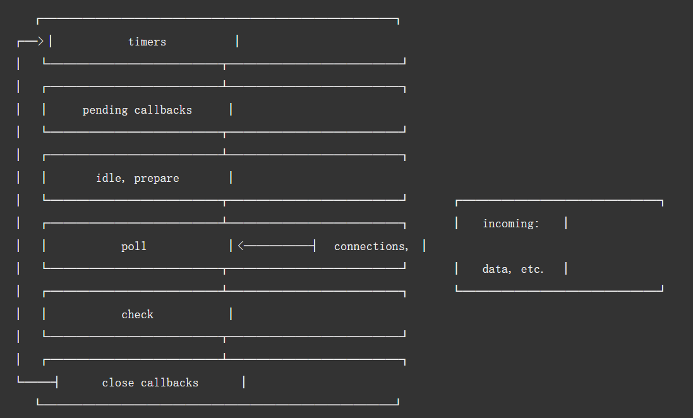
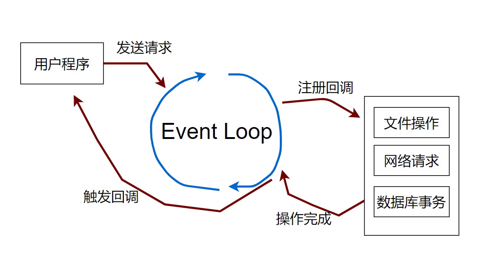
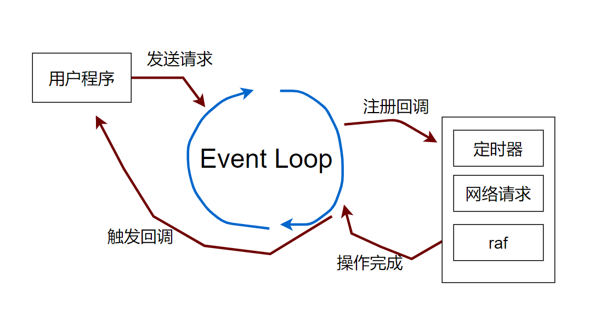
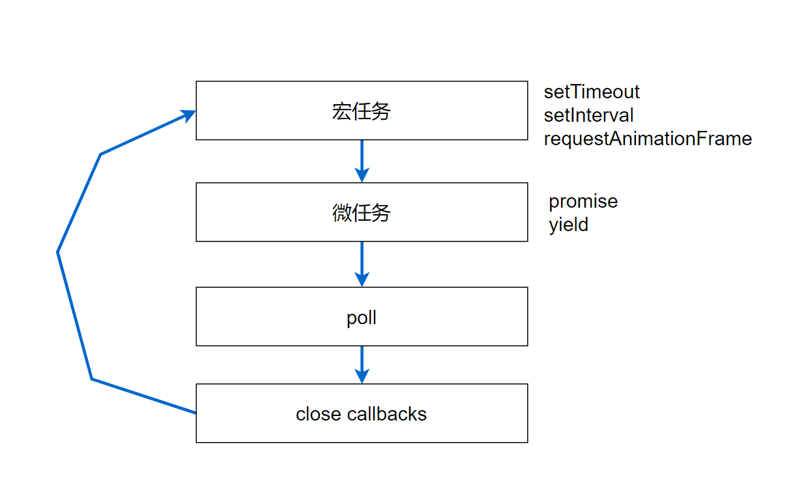

# Node.js 的进程


## 什么是进程？

进程是操作系统分配资源的最小单位——

但这不是定义，真正的定义是：**进程是应用程序的执行副本**。

启动应用程序：应用程序（磁盘)  --> 进程（内存中）


在这个过程中，操作系统要给进程分配资源，这些资源包括：

- 用户和组（哪个用户、组启动的进程）
- 目录资源
  - 进程的工作目录（看我演示）
  - 进程的可见目录
- 文件资源
  - 设备资源
  - 网络资源
  - 数据文件
  - 代码文件
  - ……
- 主线程

注意：进程不能执行程序！ —— 执行程序的是线程。操作系统会为每个进程分配一个主线程，然后进程还可以分配其他线程。


## Node.js的进程


Node.js的进程也是进程，进程下可以有很多线程。进程是Node引擎的执行副本，是操作系统分配资源的最小单位。Node.js下有很多线程一起完成执行程序的工作。

- Node.js进程也有主线程
- Node.js进程也可以使用多线程（只不过不允许用户用）
- Node.js进程有工作目录
- Node.js进程可以拥有文件资源
- ……


总之，操作系统给进程的，Node.js进程也都能享受，操作系统不给进程的Node.js进程也没有。从这个层面看，Node.js进程、Java进程、Python进程没有本质区别。


## Node.js的线程模型


进程是分配资源的，线程是执行程序的。

你如果问：**为什么，不既分配资源，也执行程序，统一线程和进程？**

那是因为进程需要的资源多，线程需要的资源少。线程只需要执行程序相关的资源：

- 程序计数器（执行到哪一行）
- 栈（存储执行程序的中间结果）
- 寄存器（辅助计算以及控制）


**形象的说，创建进程是秒级的，创建线程是ms级的。** 


所以，Node.js是**单进程**吗？


**没有单进程**这个说法，只有单线程。进程作为应用的执行副本，本身就是一个完整实体，也没有多进程这种说法。 

**Node.js是单线程吗？**

Node.js进程不是单线程的，内部有很多线程。 用户写的Node.js程序只在一个线程中执行。

线程的本质是抽象要并发(concurrent)做的事情，比如说：

- 浏览器渲染
- 用户操作界面
- 发送网络请求


这3件事情，用3个线程来表达，看上去这3件事情就可以同时被完成，这就是并行的能力。

Node.js每遇到一件需要操作系统支持的事情，就会使用一个单独的线程。比如说：

- 读取文件
- 发送网络请求
- 定时器
- ……


为了防止线程太多，Node.js内部有一个线程池，用于处理需要OS支持的行为。

对于用户的程序，Node.js也用一个单独的线程。

那么Node.js为什么不让单线程执行所有的程序呢？——

思考下面这样一个同步模型会发生什么？

---- Long User Task ---|  ---- Handler Network I/O ---- 

- 渲染会阻塞网络请求你能接受吗？ 
- 发送请求会阻塞其他程序的执行你能接受吗？


## 方案：基于事件循环




能不能先给一个简化的模型？



浏览器是这样的吗？ —— 当然是一样的工作原理。



所以核心是：Event Loop。 Event Loop是什么？

- Event Loop是一个单线程程序
- Event Loop是驱动javascript程序执行的动力源

将下面的程序带入Event Loop帮助你思考：

- setTimeout
- requestAnimationFrame
- setInterval
- new Promise(...)

再思考下这些程序（触发消息循环吗？）

- a = a + 1
- for(let x of arr) {...}
- arr.splice(...)


消息循环什么时候获得控制权？ ——用户线程放弃控制权的时候。举个例子：

```tsx
// Helloworld.ts
setTimeout(() => {
    //....
}, 1000)

```

上面程序什么时候进入消息循环？

- A. 第0秒
- B. 第1秒


Event Loop 也没有事情可做了怎么办？ 

- 如果消息循环上所有注册的任务都处理完了（切换回用户程序）
- 用户程序如果没有事情做，那么就结束执行


我们通常将用户程序称为：主栈(Main Stack)上的程序。本质上，消息循环和用户程序在同一个线程中执行，因此也发生在Main Stack上。 

那么定时器、网络请求、数据库操作、文件操作等等行为，发生在哪里？

- 发生在线程池上


所以，这张图到底在说啥？


图中是Node.js消息循环中对任务优先级的控制。

先问一个问题，**用户定时器**的优先级高，还是**读取文件回调函数**的优先级高？ 

- **setTimeout** vs fs.readFile(...., **callback**)

可不可以先到先得（这个叫做朴素的公平性），结果就是：定时器会更加不稳定。

另一方面，从操作系统接收到网络请求、文件读取有了结果的优先级，和回调函数相比，谁更高？ 

- fs.readFile(...., **callback**)
- 文件读取成功的消息

同学可能问：上面不是一个东西吗？——

- 前者是一个callback函数
- 后者是操作系统给消息循环的通知

当然是前者高，这是因为前者代表一次**先**读取完的请求，后者代表一次**后**读取完的请求。


## 浏览器中也是这样吗？


当然，只要是V8引擎，都是类似的设计。



浏览器中用户程序(Main Stack)先执行，Main Stack没有要执行的内容了，进入消息循环。有宏任务先执行宏任务，任何一个宏任务执行完都检查有没有微任务。

总体来说：宏任务是由宿主发起的，而微任务由JavaScript自身发起。Node.js为什么不沿用宏任务、微任务而使用多级队列？


这是因为Node.js并不是在处理用户交互（UI）。用户交互程序的特点就是用户对等待0容忍。因此一个宏任务，比如一次鼠标点击（onClick)，应该被马上执行。如果一个宏任务被响应，其中如果有Promise也应该尽快响应。Node.js不需要这样，因此很大的一个区别就是：

- Node.js总是执行完一级队列再执行下一级
- 浏览器执行一个宏任务然后执行所有的微任务


**划重点：原理实现一致(V8)的机制，实现根据不同场景有差异。**


## 总结


Node.js不是一个单线程模型，从设计上它的用户程序和EventLoop在一个线程上执行——因此也在一个CPU核心上执行。因为，一个线程同一时刻只在一个CPU上执行。在Node.js进程被创建到销毁的这段时间，EventLoop将一直存在，因此这个线程会在一个CPU上完成所有的工作。那么，其他线程，比如文件系统访问、网络请求也是在一个CPU上吗？ 当然可以不是，它们可以用线程池技术利用多核的特性。

所以Node.js是单线程吗？ —— 和面试官要说清楚。 你说是不是单线程都可以，毕竟用户程序+EventLoop是在单线程执行的。 但是Node.js进程内部是有多线程模型的，之所以用户程序+EventLoop单线程，是因为在**非计算密集型**（也就是I/O密集型）的工作场景下，这样效率最高。


另外，setTimeout和setImmediate哪个优先？ ——这不重要。 你在写程序中开始思考这个问题，说明程序写错了。 面试官问，你告诉它这不重要。对程序员来说，它们都是异步，异步就**不要对他们的执行顺序做任何假设**。

管他是宏任务、微任务、callback还是timer，通通异步转同步（promise,yield用起来）。

把更多的时间花在更有价值的思考上，多问自己这几个问题：

- 还认为JS是单线程吗？JS进程内有线程池吗？ 
- 任务的本质是协程（或者线程吗）？
- 为什么不用多线程设计Node.js？
- 异步转同步（yield,async)性能下降吗？

