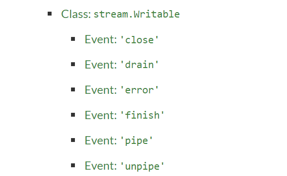

# Node.js 的标准API


## 和浏览器中的JS差异


总体来说，从JS的语法层面，Node.js中的程序和浏览器中的程序是一样的，完全一样！


有同学会说， node.js中有require函数，例如：

```tsx
const fs = require('fs')
```

但是这并没有超出js语法设计的范围，只不过多了一个全局函数`require` 。


## Node的标准库函数


node的标准库函数可以直接`require` 使用，举个例子：

```tsx
const fs = require('fs')

const fileContent = fs.readFileSync('./a.txt', 'utf-8')
```


Node的标准库很大，可以在这里阅读完整的文档。[文档地址](http://nodejs.cn/api/)

Node是一个工具，因此通常是边查边用，用熟了不用查的也会有，但是只是一小部分。


*感兴趣可以逐个阅读下面的官方文档：*

- *[assert 断言](http://nodejs.cn/api/assert.html)*
- *[async_hooks 异步钩子](http://nodejs.cn/api/async_hooks.html)*
- *[Buffer 缓冲区](http://nodejs.cn/api/buffer.html)*
- *[child_process 子进程](http://nodejs.cn/api/child_process.html)*
- *[cluster 集群](http://nodejs.cn/api/cluster.html)*
- *[console 控制台](http://nodejs.cn/api/console.html)*
- *[crypto 加密](http://nodejs.cn/api/crypto.html)*
- *[debugger 调试器](http://nodejs.cn/api/debugger.html)*
- *[dgram 数据报](http://nodejs.cn/api/dgram.html)*
- *[diagnostics_channel 诊断通道](http://nodejs.cn/api/diagnostics_channel.html)*
- *[dns 域名服务器](http://nodejs.cn/api/dns.html)*
- *[domain 域](http://nodejs.cn/api/domain.html)*
- *[Error 错误](http://nodejs.cn/api/errors.html)*
- *[events 事件触发器](http://nodejs.cn/api/events.html)*
- *[fs 文件系统](http://nodejs.cn/api/fs.html)*
- *[global 全局变量](http://nodejs.cn/api/globals.html)*
- *[http 超文本传输协议](http://nodejs.cn/api/http.html)*
- *[http2 超文本传输协议2.0](http://nodejs.cn/api/http2.html)*
- *[https 安全超文本传输协议](http://nodejs.cn/api/https.html)*
- *[inspector 检查器](http://nodejs.cn/api/inspector.html)*
- *[Intl 国际化](http://nodejs.cn/api/intl.html)*
- *[module 模块](http://nodejs.cn/api/module.html)*
- *[net 网络](http://nodejs.cn/api/net.html)*
- *[os 操作系统](http://nodejs.cn/api/os.html)*
- *[path 路径](http://nodejs.cn/api/path.html)*
- *[perf_hooks 性能钩子](http://nodejs.cn/api/perf_hooks.html)*
- *[process 进程](http://nodejs.cn/api/process.html)*
- *[punycode 域名代码](http://nodejs.cn/api/punycode.html)*
- *[querystring 查询字符串](http://nodejs.cn/api/querystring.html)*
- *[readline 逐行读取](http://nodejs.cn/api/readline.html)*
- *[repl 交互式解释器](http://nodejs.cn/api/repl.html)*
- *[report 诊断报告](http://nodejs.cn/api/report.html)*
- *[stream 流](http://nodejs.cn/api/stream.html)*
- *[string_decoder 字符串解码器](http://nodejs.cn/api/string_decoder.html)*
- *[timer 定时器](http://nodejs.cn/api/timers.html)*
- *[tls 安全传输层](http://nodejs.cn/api/tls.html)*
- *[trace_events 跟踪事件](http://nodejs.cn/api/tracing.html)*
- *[tty 终端](http://nodejs.cn/api/tty.html)*
- *[url 网址](http://nodejs.cn/api/url.html)*
- *[util 实用工具](http://nodejs.cn/api/util.html)*
- *[v8 引擎](http://nodejs.cn/api/v8.html)*
- *[vm 虚拟机](http://nodejs.cn/api/vm.html)*
- *[wasi WebAssembly系统接口](http://nodejs.cn/api/wasi.html)*
- *[webcrypto Web加密](http://nodejs.cn/api/webcrypto.html)*
- *[Webstream Web流](http://nodejs.cn/api/webstreams.html)*
- *[worker_threads 工作线程](http://nodejs.cn/api/worker_threads.html)*
- *[zlib 压缩*](http://nodejs.cn/api/zlib.html)


总的来说，所有的API中，最重要的是进程(child_process)和文件操作API(fs)，这个在前端使用频率是最高的。原因有这几个方面：

- 工程化脚本/脚手架制作过程中需要

  - 大量的文件操作
  - 执行shell指令

- 其他API通常有更好的**第三方**替代品

  - 比如socket操作通常会用socket.io
  - 数据库操作会用sequlize
  - 网络请求会用node-fetch
  - 定时器（在没有非常精确性要求的时候）可能直接setTimeout, setInterval
  - url处理会直接用qs

- 还有一些低频使用的api

  - v8：（和v8引擎交互的库）
  - crypto：加密解密的库
  - ……

  

  总体来说，Node.js的知识有这么几个层面：

  - 基础语言：Javascript/Typescript（必须全面掌握、无死角、80%不需要查资料）
  - Node.js的原理（深刻思考）
    - 进程和线程模型
    - Event Loop + Task的多级队列
    - I/O的本质
  - Node.js的标准（这节课的目标， 必须基于理解掌握）
  - 常用库：fs、child_prcess、path等， 非常用库(cluster, v8, crypto)等——先了解，用到再查资料

  

  

  ## Node.js的异步

  

  异步是Node.js的一大特色，以文件读取为例，Node提供了阻塞+非阻塞两个API：

  ```tsx
  const fs = require('fs')
  
  
  // 阻塞接口
  const data = fs.readFileSync('a.txt', 'utf8')
  
  // 非阻塞接口
  fs.readFile('a.txt', 'utf8', function(err, data){
      
  })
  
```
  

  
### 阻塞和非阻塞
  
阻塞(Blocking)代表程序在接收到数据之前是什么都不做的。阻塞代表的是线程的阻塞，阻塞不意味着同步。同步(Synchronous)代表程序执行的顺序关系和人的思考方式一致。
  

  
能不能举个同步非阻塞的例子？
  
  ```tsx
  await fetch('....')
```
  

  
上面的程序`await` 将异步程序转成了同步程序，总体来说，程序的创作风格是同步的，而且没有发生阻塞。什么叫没有发生阻塞：
  
- fetch看上去在等待，但是如果有setTimeout会利用fetch等待这段时间执行（也就是线程没有阻塞）
  

  
非阻塞接口，顾名思义，就是程序不会触发阻塞。现在问题来了，非阻塞很好理解，发生`readFile`调用的时候在EventLoop上注册，然后等待回调。
  

  
  

那么阻塞怎么实现呢？ 阻塞的情况不走上图的消息循环注册，而是直接调用操作系统API。

举个例子，你和某个网站之间的延迟是1s，发送一次请求的round-trip-time(RTT)——来回时间平均是2s。 那么理论上，1min可以发30个请求。

如果用阻塞api去完成发送100次请求的工作，需要多久呢？ 

 T = 100 * 2s = 200s

非常好算， 很直观！ 如果能并行发送呢？ 比如开10个线程，那么理论的极限速度是：

T = 100 * 2s / 10 = 20s 

快了10倍。

因此我们需要非阻塞的接口，例如下面：

```tsx
const fetch = require('node-fetch')

fetch('...')
fetch('...')
fetch('...')
fetch('...')
……
fetch('...')
fetch('...')
fetch('...')
fetch('...')
fetch('...')
fetch('...')
```

因为`fetch` 是一个非阻塞API，本质每次fetch会在EventLoop上注册回调，这样可以允许多个`fetch` 同时发送。在EventLoop机制的背后，nodejs会用线程池技术将请求并发的发送出去。因为网络请求的时间更多消耗在了传输介质上，比如路由器、网关、防火墙、线路间数据传输、基站等等，网络请求本身对发送终端的性能消耗是很小的，哪怕同时发送几百个请求对发送终端的压力并不大。

有同学问：

```tsx
for(let i = 0; i < 100; i++){
    await fetch(...)
}
```

这不是阻塞吗？ 错！ 这是同步。 这里不是没有阻塞，阻塞指的是阻塞了线程执行。在 Node环境准确说，阻塞的是用户程序+EventLoop的执行线程。如果`await` 阻塞了，那么Node.js会处于假死状态。但是显然，这个时候node.js是可以响应其他的setTimeout等操作的。例如：

```tsx
setInterval(() => {
   // 这里会和100次fetch调用穿插执行
}, 1000)
for(let i = 0; i < 100; i++){
    await fetch(...)
}
                

```


### 阻塞API和非阻塞API的参数关系


Node.js的API设计高度统一。阻塞API和非阻塞API参数刚好差1个回调函数。

```tsx
fs.readFileSync(path, encoding)
fs.readFile(path, encoding, callback)
```

这种设计可以在所有其他的API中看到，例如这个加密的API:

```tsx

import {scryptSync, scrypt} from 'crypto'

// 非阻塞API
scrpty("password", "salt", 64, (err, derivedKey) => {
    if (err) throw err 
    console.log(derivedKey)
})

// 或者阻塞API

try{
  const derivedKey = await scryptSync("password", "salt", 64)    
}catch(ex) {
  ...
}


```


为什么err是第一个参数——错误先行，防止忘记处理错误？ —— 这不重要。但是所有的回调函数都是这样的设计标准，这个很重要！这个是回调函数的——**调用约定**（call convention)。

## node的import和require

`import` 不是node.js原生支持的，需要使用babel转义成require，或者直接使用ts-node执行程序。从这个角度看node和浏览器中的程序是高度统一的。


### 异步转同步：promisify 

非阻塞接口性能更好，但是会产生回调地狱。那么怎么办呢？ 在node的标准库`util` 中，提供了一个promisify方法，帮助你将一个非阻塞+回到的方法转成一个promise方法。

```tsx
import {promisify} from 'util'
import fs from 'fs'

const readFile = promisify(fs.readFile)

async function foo(){
    const content = await readFile("a.txt", 'utf8')
}
```


## node的resolve


node在解析模块的时候，例如 `require('fs')` 时，会遵循这样的顺序：

例如：

```tsx
// /root/src/folder/A.ts
import {b} fro './moduleB'
```

 那么解析顺序如下：

1. `/root/src/folder/moduleB.ts`
2. `/root/src/folder/moduleB.d.ts`
3. `/root/src/moduleB.ts`
4. `/root/src/moduleB.d.ts`
5. `/root/moduleB.ts`
6. `/root/moduleB.d.ts`
7. `/moduleB.ts`
8. `/moduleB.d.ts`

如果require的是一个module，例如：

```tsx
import {b} from 'moduleB'

```

那么解析顺序如下：

1. `/root/src/node_modules/moduleB.js`

2. `/root/src/node_modules/moduleB/package.json` (if it specifies a `"main"` property)

3. `/root/src/node_modules/moduleB/index.js`

   

4. `/root/node_modules/moduleB.js`

5. `/root/node_modules/moduleB/package.json` (if it specifies a `"main"` property)

6. `/root/node_modules/moduleB/index.js`

   

7. `/node_modules/moduleB.js`

8. `/node_modules/moduleB/package.json` (if it specifies a `"main"` property)

9. `/node_modules/moduleB/index.js`

如果是Typescript，那么解析顺序更加复杂一些：

1. `/root/src/node_modules/moduleB.ts`

2. `/root/src/node_modules/moduleB.tsx`

3. `/root/src/node_modules/moduleB.d.ts`

4. `/root/src/node_modules/moduleB/package.json` (if it specifies a `"types"` property)

5. `/root/src/node_modules/@types/moduleB.d.ts`

6. `/root/src/node_modules/moduleB/index.ts`

7. `/root/src/node_modules/moduleB/index.tsx`

8. `/root/src/node_modules/moduleB/index.d.ts`

   

9. `/root/node_modules/moduleB.ts`

10. `/root/node_modules/moduleB.tsx`

11. `/root/node_modules/moduleB.d.ts`

12. `/root/node_modules/moduleB/package.json` (if it specifies a `"types"` property)

13. `/root/node_modules/@types/moduleB.d.ts`

14. `/root/node_modules/moduleB/index.ts`

15. `/root/node_modules/moduleB/index.tsx`

16. `/root/node_modules/moduleB/index.d.ts`

    

17. `/node_modules/moduleB.ts`

18. `/node_modules/moduleB.tsx`

19. `/node_modules/moduleB.d.ts`

20. `/node_modules/moduleB/package.json` (if it specifies a `"types"` property)

21. `/node_modules/@types/moduleB.d.ts`

22. `/node_modules/moduleB/index.ts`

23. `/node_modules/moduleB/index.tsx`

24. `/node_modules/moduleB/index.d.ts`


## Node的事件

Node.js还提供了一套标准的消息模型，很多node对象是提供消息的，例如用读取流操作文件：

```tsx
const fin = fs.createReadStream('hugefile.data')

process.stdout.on('pipe', (src) => {
    console.log('something is pipe to stdoout')
})

fin.pipe(process.stdout)
```

`pipe` 操作将一个流的输出导入另一个流作为输入。上面程序将读取文件流读取到的数据（Output），作为标准输出流的输入(Input)。

`pipe` 会在流有管道输入的情况下发生。在上面例子中`stdout` 也被抽象成了流，思考为什么将进程的标准输出文件抽象成流（标准输出流）？


除了`pipe` 还有很多类型的事件，首先你可以在文档中查到它们：



要学会读文档。这里我也帮大家做一个简单入门，介绍一下几类常见的事件：

#### close

流关闭时触发，比如说读取1G文件，全部读完之后触发`close` 事件。

通常close指的是流或流依赖的资源被关闭。比如说文件流依赖的文件被关闭了，就是`close`。


#### finish

finish通常是流使用完成了，用户显式调用`stream.end` 方法后回触发。


#### drain

drain在英文中是排水（流干）的含义。比如说浴室的水池放水到流干， 就是drain。放到流的事件中，通常指流已经空了。比如说有一个输入流不停向一个输出流中传送数据，具体点：一个读取文件的流，不停将数据pipe到一个网络流中发送出去。如果读取太快，发送跟不上，那么网络流的内部缓冲区会被写满。这个时候，网络流会报错，告诉输入流已经无法写入，那么整个过程就会停止。这个时候可以监听网络流的`drain` 消息，等到网络流将内部缓冲区中的数据清空，在重新发送。

```flow
fs=>operation: 文件流
net=>operation: 网络流
card=>operation: 网卡


fs->net->card


```


举个具体的程序例子：

[来自Stackoverflow](https://stackoverflow.com/questions/18932488/how-to-use-drain-event-of-stream-writable-in-node-js)

```tsx
function writeOneMillionTimes(writer, data, encoding, callback) {
  var i = 1000000;
  write();
  function write() {
    var ok = true;
    do {
      i -= 1;
      if (i === 0) {
        // last time!
        writer.write(data, encoding, callback);
      } else {
        // see if we should continue, or wait
        // don't pass the callback, because we're not done yet.
        ok = writer.write(data, encoding);
      }
    } while (i > 0 && ok);
    if (i > 0) {
      // had to stop early!
      // write some more once it drains
      writer.once('drain', write);
    }
  }
}
```


#### data

data一般发生在流中被写入新的数据。举个例子：

```tsx
const proc = exec("ls")
proc.stdout.on("data", chunk => {
    console.log(chunk)
})

proc.stderr.on("data", chunk => {
    console.log(chunk)
})
```


还有许多有趣的事件，这个大家用到了自己查资料了。 事件是可以自定义的，你只需要继承于EventEmitter类。

```tsx
class Foo extends EventEmitter {    
}

const foo = new Foo()

foo.on("custom", data => {
    console.log(data)
})

foo.emit("custom", "123")
```

通过上述方式你可以实现node.js的组件间通信。


## 总结


node有哪些标准：

- 标准库函数都可以直接require/import用
- I/O操作都提供阻塞、非阻塞且设计了严格的调用约定
  - 阻塞操作比非阻塞操作少一个参数（回调函数）
  - 回调函数的第一个参数是错误，第2个参数起是回调信息（包括数据）
  - 提供了promisify将非阻塞+回调的异步设计转成同步
- node设计了一套严格的模块解析规范