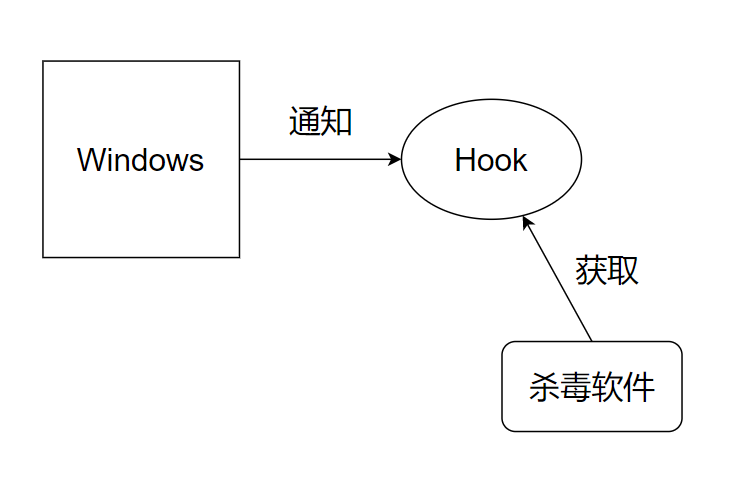

# React Hooks介绍


React Hooks需要从两个方面理解：

- 从它的作用：A) 让React更好的拥抱函数式 B) 更好的解决组合问题（关注点分离）
- 从它的工作原理：从原理上它们是钩子(hook)，当React生命周期发生变化的时候，会触发它们。


## 从作用角度分析


这是Hooks出现前Class风格的React组件

```tsx
class Foo extends Component {
    constructor(){
        this.state = {...}
    }
    
    // 这些叫生命周期函数
    componentDidMount(){...}
    shouldComponentUpdate() {...}    

    render(){
        return <div>...</div>
    }
}
```


Hooks出现后，我们讲React组件看做一个函数：

```tsx
function Foo(){
    return <div>...</div>
}
```

没有了生命周期函数，而是变成了Hooks。

比如下面的程序，是一个每秒更新1次的累加器。

```tsx
function Foo(){
    const [count, setCount] = useState(0)
    useEffect(() => {
        timer(0, 1000)
        	.subscribe(i => setCount(i))
    }, [])
    return <div>{count}</div>
}
```

先不要关注它具体的用途，下节课我们开始保姆式的教学。这段程序中**没有了class**，只有**函数**。所以这是一种编程风格的变化，那么具体来说这是一种怎样的风格变化呢？

- 组件是一个用来渲染函数纯函数**（重定义）**：不再关注生命周期，不需要理解生命周期，不需要背诵生命周期函数，更接近React ` component = f(data)`的定义。
- 细化解决用户痛点：针对状态、作用、上下文、缓存等等方面，为用户量身定做hook函数；而不是像之前都需要用户自己在类中实现程序完成。
- 让用户以最小的代价实现关注点分离。

关于3，举一个例子：

```tsx
function HomePage(){
    const [productList, load] = useService("product").get()
    const [ads, loadAds] = useService("ads").get()
    const [suggestions, loadSuggs] = useService("suggestion").get()
    return <>
       <TitleBar />
       <ProductList list={productList} loadFN={load} />
       <Ads ads={ads} />
       <Suggestions list={suggestions} />
    	 <FootBar />
    <>
}
```

上面程序在一个页面中对3个关注点：

- 产品列表
- 广告
- 推荐列表

进行了分离，非常干净。

`useService` 是一个自定义的hook，可以由用户自己来实现。

划重点：**Hooks更好的拥抱了函数式，彻底改变了 React的编程风格，简化了用户的理解，并且可以很好的帮助用户做关注点分离。**

## 从原理角度分析


从原理角度，钩子（ Hooks）是什么？

- Git的Web hooks是什么？
- 杀毒软件监控操作系统的Hooks是什么？
- React的Hooks是什么？

Hooks本质上是一种消息机制。



Hook的作用是从系统外部监听某个系统内部的变化，并和某种特定事件挂钩。比如Git的Web Hooks看到Git有提交，就触发一个HTTP请求。操作系统的进程Hook，看到有新进程创建就发送一条消息，然后杀毒软件会就可以获取这条消息。

所以Hook的实现是两个方面：

- 被监听的实体在特定情况下发送消息给Hook（比如打开文件、Git提交、新建进程……）
- Hook对象收到这种消息完成某个具体的工作（比如发送Http请求、开始杀毒、Hot Reload）

那么React Hook在干嘛？ 一方面React某种特定状态发生变化的时候会通知Hook，然后 Hook 再完成某个特定行为。

例如`useEffect` ，当React渲染的时候会触发这个Hook，如果这个hook的依赖发生变化，就会执行这个Hook上关联的函数。`useState` 是一个反向的Hook，当用户设置状态变更的时候，会反向触发React的更新。

划重点：Hooks是一种通知机制。


## 总结

面试官：给我讲讲React Hooks的理解？

