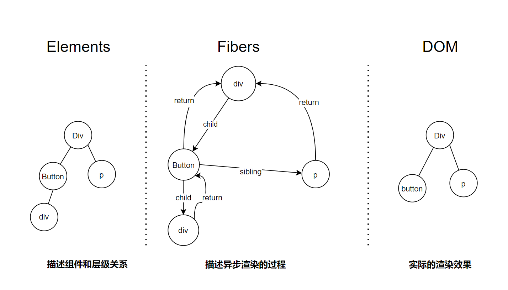
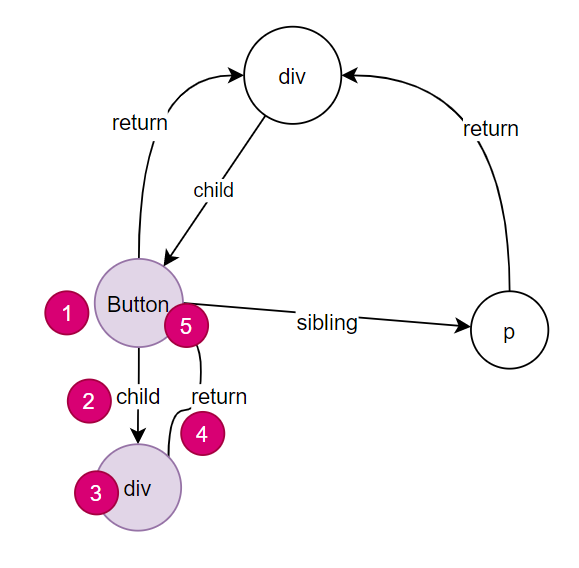
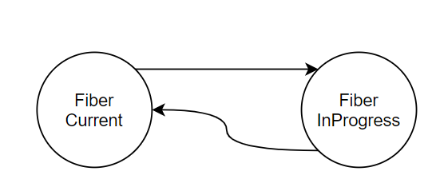
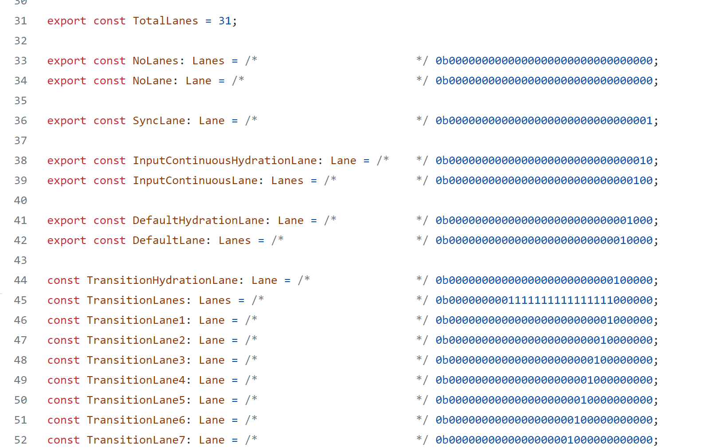

# Fiber 介绍


## DOM、Element和Fiber

我们先试图通过下面这个简单的例子来理解什么是Fiber

```tsx
<div>
   <Button><div>点我</div></Button>
   <p>点击按钮会带来惊喜！</p>
</div>
```



- ReactElement描述组件信息、组件的层级关系
- Fiber描述组件Diff等工作的调用关系
- DOM对应实际的渲染效果

下图描述的是当Button更新时的整体路径。 



## Fiber是什么？


- Fiber是React Element数据的镜像
- Fiber是一份Diff工作
- Fiber模拟函数调用关系

## Fiber的结构

```tsx
function FiberNode(...) {
  // 工作类型(Fiber类型)
  this.tag = tag;
  
  // ReactElement.key
  this.key = key;
  

  // ReactElement.type
  this.elementType = null;
    

  // Fiber
  // 执行完当前工作返回的Fiber
  this.return = null;
    
  // 当前Fiber的（最左侧）子Fiber
  this.child = null;
    
  // 当前Fiber的下一个同级Fiber
  this.sibling = null;
    
  ……
}
```


## Fiber的workInProgress



每个Fiber都有一个和自己对应的WorkInProgress。当发生变更时，原本的Fiber不变，而是构造一个WorkINProgress Fiber。当WorkInProgress构造好之后，原来的Fiber和WorkInProgress Fiber互相引用。 

`Work In Progress Fiber` 代表正在进行的工作。例如当一个组件的`state` 或者`props` 发生变更的时候，就会形成一个新的WorkProgressFiber。而DomDiff就发生在`Current Fiber` 和`Work In Progress Fiber` 间。

本质上，这是一种处理并发的技巧，叫做`Copy On Write` ——当有变更的时候，先复制原有的对象，修改完成后再替换原有的对象。

### Fiber更新的两个阶段

- 计算阶段（可中断）
  - 计算Work In Progress Fiber
  - 进行DOM DIFF，计算DOM的更新
- 提交阶段（不可中断）
  - 提交所有的更新


## Fiber的执行


驱动Fiber执行有很多种情况，主要的3中是：

- 根节点的render函数调用（例如： ReactDOM.render(\<App /\> ,) ）
- setState(useState)
- props变更

当上述情况发生时，`render` 库（如 ReactDOM)会触发Fiber的执行。

- 如果是新节点，那么创建Fiber
- 计算阶段：如果是变更，那么计算Work In Progress Fiber
- 计算阶段：render库执行，利用React 的DOM DIFF算法计算更新
- 提交阶段：应用更新


### Fiber的并行


并行，就是任务可以交替的进行，看上去好像同时发生一样。如果要做到这一点，每个Fiber应该是独立的。

理论上计算阶段，一切都是虚拟的，父节点(Parent Fiber)和子节点(Child Fiber)可以是两个Work。

有同学可能会有疑问：

*从结构上，父节点`render` 函数调用子节点`render` 函数，那么子节点必须全部完成，父节点才能返回。这样就构成了依赖关系，不能并发执行。*

**那么，Fiber能不能先完成父Fiber再完成子Fiber呢？**

答案是：可以！

因为Fiber可以先计算出所有的Work In Progress，再DIFF。

- 计算Work In Progress需要按照递归顺序逐级进行
- 对Fiber和 Work In Progress Fiber之间的DIFF工作，可以并发进行
- 理论上：部分的Update工作，也可以并发进行

### 计算的分步进行

- createElement过程不可中断，需要一次执行完成

- Fiber和Work In Progress Fiber的构建过程需要一次递归做完

- DIFF工作可以并发，也就是可以：

  - 暂停（中断）/恢复执行
  - 异步（调度执行）

  

在上述工作中，DIFF的计算量最大，因此整体看Fiber的计算过程可以并行。暂停、恢复能力， 是并行能力的副产品。并行就意味着，任务可以调度执行。

在React Fiber的设计中，也引入了调度器来调度所有的计算任务。 

### 渲染过程的进行


DOM DIFF过程可以并行，那么DOM DIFF的结果也可以并行的更新。 比如：

- 一张页面的不同区域发生变更
- 用户输入的同时播放了动画


划重点：独立的任务非常适合并行，每个Fiber都是一个独立的任务。任务可以按照不同的顺序执行，最终的结果不发生变化，这就是Fiber提供最核心的能力。

因此，我们也可以为 Fiber分配优先级。 目前Fiber中有一个成员：`lanes` ，这个成员在描述Fiber的优先级。



## 总结


- Fiber是？

  - 1.

  - 2.

  - 3.

    

  