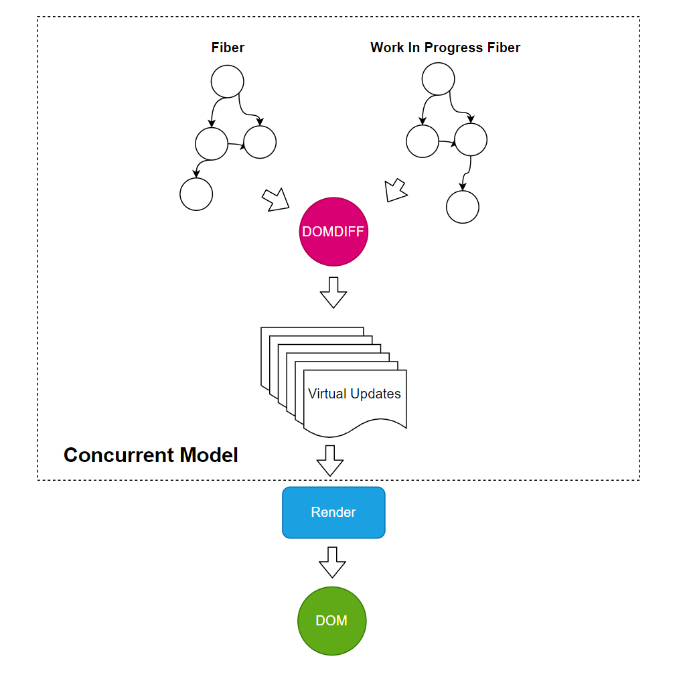

# Reconciler和Render的关系


先复习下：

- React中VirtualDOM是一个虚拟概念，下面两种类型都对应了VirtualDOM
  - ReactElement
  - Fiber
- 在Fiber出现后，DOM DIFF算法发生在Fiber和Work In Progress Fiber之间，并计算更新


现在我们来思考几个问题：

- 计算出来的更新如何应用到页面上？




在上面的模型中：

- 提供并行(Concurrent Mode)的核心是Fiber
- 提供渲染能力的是`Render` （例如ReactDOM.render)
- 提供DOM DIFF的模块叫做Reconciler


具体的：

```tsx
render = Reconciler(HostConfig)
```


当React进行真实渲染的时候，VirtualDOM的Diff算法会计算出更新步骤。但是当真正更新的时候，我们会遇到难题，就是如何支持多端渲染？ 

- DOM
- React Native
- Canvas
- ……

这个时候，需要一个调和器(Reconciler)将3部分个功能结合起来：

- VirtualDOM： 对组件层级结构的描述
- Reconciliation:  计算DOMDIFF
- HostConfig ：对于React渲染需要的具体端(DOM/React Native等)的封装
  - 删除元素的能力
  - 改变属性的能力
  - 插入元素的能力
  - 替换元素的能力
- ……


具体的，Reconciler允许我们自定义Render（例如写一个ReactDOM.render)

```tsx
const Reconciler = require('react-reconciler');

const HostConfig = {
  // You'll need to implement some methods here.
  // See below for more information and examples.
};

const MyRenderer = Reconciler(HostConfig);

const RendererPublicAPI = {
  render(element, container, callback) {
    // Call MyRenderer.updateContainer() to schedule changes on the roots.
    // See ReactDOM, React Native, or React ART for practical examples.
  }
};

module.exports = RendererPublicAPI;
```


更多资料可以参考：https://github.com/facebook/react/tree/main/packages/react-reconciler