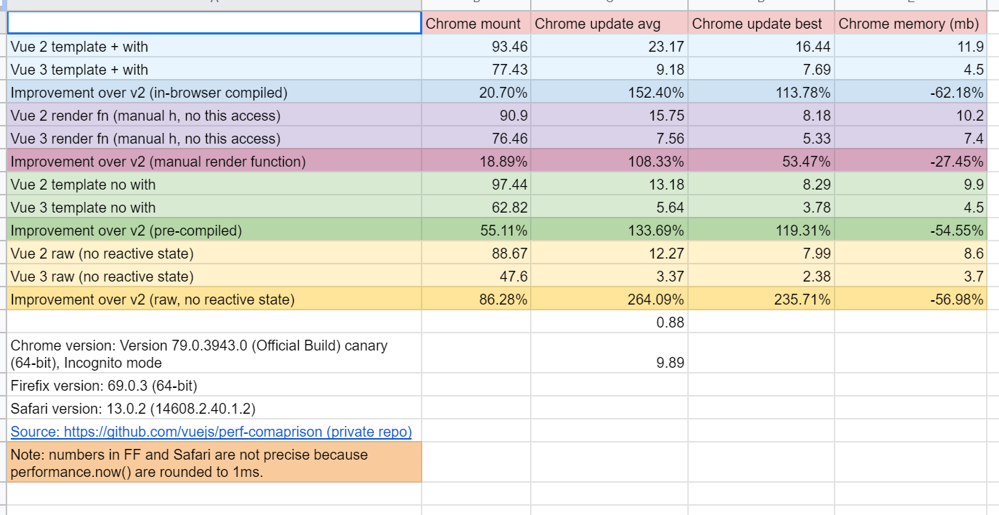

# Vue3整体解读


vue 3 = *vue*-next

Vue3可以说对vue的程序应该如何写，重新下了定义：

- JSX
- Typescript
- Composition API
- reativity

上面4个更新虽然不全是vue3带来的，但是我们可以放到一起分析，算作对`vue-next` 程序的定义。

## Why Not SFC?

有同学可能会问？ SFC不香吗？

我们来看看，在TS环境下，SFC需要一个`shim` 文件：

```tsx
declare module "*.vue" {
  import { DefineComponent } from "vue";
  const Component: DefineComponent;
  export default Component;
}
<template
```

`declare` 的作用是？ ——告诉Typescript编译器 `declare` 的部分在源代码之外提供，不需要编译器处理。当遇到"*.vue"的文件的时候，TS编译时先将他们当做一个会`export default Component` 的类型。

如果用`tsx` 写，就不需要这个`shim` 。

有同学会问：多一个`shim` 少一个`shim` 重要吗？ ——从架构角度重要！通常你的项目概念越多，意味着设计越差。

当然这只是一个给你一个开胃菜，还有很多其他的原因。

其实是在`SFC` 中你需要写`template` 和`script` 标签，这个方式有两个缺点：

- 这样的设计不够灵活
  - 需要v-show/v-if/v-for等(用户可以少记忆东西)
  - 关注点被分离（模板也好、script也好，都是解决某个关注点的一部分，在SFC中被强行分离了）。你可以思考一个template和script都很长的场景。
- TS的类型检查
  - 函数组件可以最大程度复用TS的类型检查（比如检查属性）

我们来看一个`vue` 的计数器程序：

参考文件：Counter.tsx

```tsx
function useCounter() : [Ref<number>, () => void]{
	const counter = ref(0) 

	function increment(){
		counter.value ++
	}

	return [counter, increment]
}

export default {
	setup() {
		const [counter, increment] = useCounter()
		return () => <div>
			count is : {counter.value}
			<button onClick={increment}>add</button>
		</div>
	}
}
```

从这个程序你看到了什么？

- counter逻辑的集中管理
- 强大的封装能力
- 少量的记忆要求


## cmposition API


Composition AP是一系列函数式API的合集。


有用来初始化、定义组件的：

- setup
- defineComponent

有支持响应式数据的：

- ref
- reactive
- toRefs
- computed
- watch
- watchEffect

有支持生命周期管理的：

- onMounted
- onUnmounted


总体来说， Composition API

- 提升了组合能力(自定义的Composition API)
- 提供了Reactive Programming
- 提供了函数式（简化API设计）

具体我们在Composition API的讲解中继续讨论。


## Vue3.0的性能

下面是Report，可以看到vue3带来了不错的性能增长。



不过从实践侧提供的消息（一些大厂的前端Leader），Vue3并没有明显的提升性能。 这个和Vue3的渲染机制，没有时间切片有关。 一些大型前端系统，没有时间切片会导致在页面打开一开始执行周期过久。


## Reactivity

Reactivity 是Vue3提供的核心能力，配合函数式的Composition API使用非常方便。

**响应式编程是什么？**

Reactive Programming——让类型自发的响应环境的变化。 

**Reactive ：** 一个值是Reactive，那么这个值可以被监听；一个对象是Reactive，那么这个对象可以被监听。一个函数是Reactive，那么这个函数在提供Reactive的能力，比如去创造一个Reactive的值或者对象。

**Be Reactive**！！

让程序变得Reactive是很好的一个思路。程序如果不是Reactive，那么往往是Passive（被动的）。响应的反义词为什么是被动？ 因为Reactive代表一部分程序（类型）主动的去通知周边自己做了什么，另一部分类型主动监听变化，主动做出判断并完成操作。

程序变得Reactive之后，每个模块**好像活了一样**，不需要程序员主动的下指令，而是程序自己主动完成工作。——从这个角度看Reactive的反义词就是Passive。

### 声明式（Declarative) 

Reactive的程序往往是声明式的。所谓声明式，就是程序员的声明要做什么？不要做什么？而不是写一大堆计算逻辑。


首先声明式需要更好的封装：

```tsx
const arr = []
for(let i = 0 ; i < 10000; i++)
{
    arr[i] = i
}

// 声明式
const arr = range(0, 10000)
```


第二：声明式会创造语言

```ts

const div = document.createElement('div')
div.style.width = 100

// 声明式
const div = <div style={{width : 100}} />
```

第三：声明式往往是Reactive

```tsx
import userStore from './userStore'

export default {
	setup() {
		const logined = ref(userStore.logined())
    
    userStore.on(e) {
        switch(e.type) {
            case "logined":
                logined.value = true
                break
            case "logout":
                logined.value = false
                break
        }
            
    }
		return () => {
        if(logined.value) {
            return <div>您好！欢迎光来临</div>
        }
        else {
            return <div>请登录……</div>
        }

    }
	}
}


```

上面程序中组件在响应全局用户状态的变化，这样就将组件和全局状态（userStore)解耦：

- 组件迭代不用关心userStore迭代
- userStore迭代（甚至有新的版本），组件不需要调整

上面代码可以做优化，就实现了业务逻辑和组件的强分离：

```tsx
function useLoginStatus(){
   	const logined = ref(userStore.logined())
    
    userStore.on(e) {
        switch(e.type) {
            case "logined":
                logined.value = true
                break
            case "logout":
                logined.value = false
                break
        }                
    }
    
    return logined.value
}
export default {
	setup() {
		const loggedIn = useLoginStatus()
		return () => <LogginStatus />
	}
}

const LogginStatus = ({loggedIn}) => {
    if(loggedIn) {
        return <div>您好！欢迎光来临</div>
    }
    else {
        return <div>请登录……</div>
    }
}
```


当然还有一个很大的好处就是声明式帮助我们更好的阅读代码。

最后也式最重要的、哲学高度的思考：Reactive让程序模块自己懂得如何做事。

- 机器人——
- AI——
- ……


## 关于：小师叔的`@skedo/vue-lexical-scope-cache` 


这是我实现的一个小工具，帮助大家可以在词法作用域更好的使用Vue的函数式+JS+TS功能，举个例子：

```tsx
export default () => {
    const counter = ref(0)
    setInterval(() => {
        counter.value ++
    }, 1000)
    return <div>{counter}</div>
}
```

上面这段程序会不断触发渲染函数重绘，因为counter是Reactive的，`counter.value++` 时会触发组件重绘。这个时候，可以用小师叔的`@skedo/vue-lexical-scope-cache` 帮助你将`ref` 和`setInterval` 绑定到当前作用域。

```tsx
import {scoped} from "@skedo/vue-lexical-scope-cache"

scoped("ref", 'setInterval')

export default () => {
    const counter = ref(0)
    setInterval(() => {
        counter.value ++
    }, 1000)
    return <div>{counter}</div>
}
```

使用了scoped后，counter和setInterval在当前vue组件中只会执行1次。 


## 总结


思考：从前端看：怎么理解Reactivity？和React是一个词义吗？ 

思考：组合能力是什么？Compostion API提供更好的组合能力，这样说对吗？


